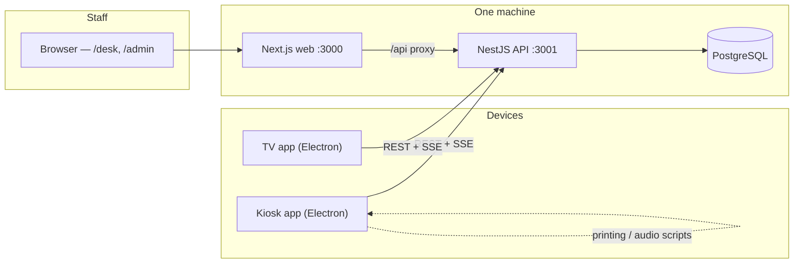

<div align="center">


# Queue Master

**Ticket queue management system for service facilities.**

Clients take numbered tickets (`A001`) at a kiosk, staff call them to desks,
a TV screen announces the numbers — multilingual, real‑time, self‑hosted.

[Documentation](docs/README.md) · [Installation](docs/installation.md) · [Configuration](docs/configuration.md) · [API](docs/api.md)

</div>

---

## What it does

| | |
|---|---|
| 🎫 **Kiosk** | Touch screen where a client picks a category and gets a printed ticket |
| 📺 **TV display** | Shows the number currently being served and the history, with voice announcements |
| 🖥️ **Desk panel** | Web panel where staff call the next client, re‑call, or finish service |
| ⚙️ **Admin panel** | Users, devices, desks, categories, colors, logos, opening hours, texts |

## Features

- **Ticket queue per category** — categories `A`–`Z`, per‑category counters, numbers up to 999 with automatic reset (see [auto reset](docs/architecture.md#automatic-ticket-number-reset))
- **Desks** — clients are called to a desk; categories are assigned to desks, users have a default desk
- **Roles** — `Device` (kiosk/TV), `User` (desk), `Admin` (everything)
- **Real‑time updates** — Server‑Sent Events, no page reloads ([details](docs/realtime.md))
- **Multilingual** — English and Polish out of the box; per‑language texts, logos and print templates ([details](docs/i18n.md))
- **Opening hours** — closed banner, optional open/close scripts on the kiosk, override switch
- **Customisable look** — every colour and both logos configurable from the admin panel
- **Ticket printing** — external script, HTML template editable per language ([details](docs/printing.md))
- **Voice announcements** — external script, e.g. espeak or pre‑generated samples ([details](docs/audio.md))
- **Markdown kiosk message** — with raw HTML support for colours and centring ([details](docs/admin-panel.md#kiosk-text-markdown))
- **Swagger API docs** — served in development at `/api/swagger` ([details](docs/api.md))

## Architecture at a glance



Full description: [docs/architecture.md](docs/architecture.md).

## Quick start (development)

```bash
# 1. PostgreSQL must be running first — the backend exits if it cannot connect
cd backend
cp config.example.json config.json   # or use .env
yarn install && yarn prisma migrate dev
yarn start:dev                       # http://localhost:3001, Swagger at /api/swagger

# 2. Web frontend (from frontend/)
cd ../frontend
yarn install
yarn --cwd apps/web dev              # http://localhost:3000

# 3. Kiosk (optional)
cd apps/kiosk
cp config.example.json config.json   # paste a device JWT from the admin panel
yarn dev
```

On first boot the backend creates an **admin** account. If `seedAdminPassword` is not
set, a random password is printed to the log **once** — see
[first login](docs/installation.md#first-login).

Production install (Docker or ZIP release): [docs/installation.md](docs/installation.md).

## Documentation

| Document | Contents |
|---|---|
| [Installation](docs/installation.md) | Docker, ZIP release, from source, first login |
| [Configuration](docs/configuration.md) | `config.json` and env vars for backend, web and kiosk |
| [Architecture](docs/architecture.md) | Components, request flow, auth cookies, ticket number reset |
| [Database](docs/database.md) | Schema, tables, migrations |
| [API](docs/api.md) | Endpoint reference, authentication, Swagger |
| [Real‑time (SSE)](docs/realtime.md) | Event list, how the frontend consumes it |
| [Admin panel](docs/admin-panel.md) | Every screen and setting |
| [Kiosk & TV app](docs/kiosk.md) | Running it, config file, logs, troubleshooting |
| [Printing](docs/printing.md) | Printer setup, templates, placeholders |
| [Audio](docs/audio.md) | Voice announcements and sample generation |
| [Multilingual](docs/i18n.md) | How language selection works, adding a new language |
| [Linux device setup](docs/linux-setup.md) | Kiosk OS, `cage`, autostart, screen layout |
| [Development](docs/development.md) | Commands, tests, project layout, conventions |
| [Troubleshooting](docs/troubleshooting.md) | Logs, 401s, common failures |

## Tech stack

NestJS 11 · Prisma 6 · PostgreSQL · Next.js 16 (App Router) · React 19 · Electron 42 · Tailwind 4 · TanStack Query · Yarn 4 workspaces · Node 22+

## Acknowledgements

Huge thanks to the people who helped make Queue Master what it is:

- **Kuba Ciepły** — ideas, feedback and a great deal of help along the way
- **Jan Potocki** — Linux device setup and deployment on real hardware
- **Maciek Talarczyk** — the Queue Master logo

## Contact

**Michał Ramus** —
GitHub: [michalramus/queue-master](https://github.com/michalramus/queue-master)

Bugs and feature requests: please open a [GitHub issue](https://github.com/michalramus/queue-master/issues).

## License

BSD 2‑Clause — see [LICENSE](LICENSE).
