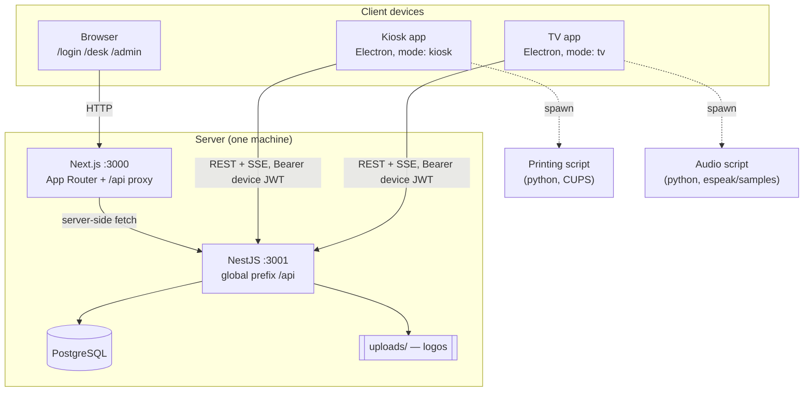

# Architecture

## Components

| Directory | What lives there |
|---|---|
| `backend/` | NestJS API, Prisma schema and migrations |
| `frontend/apps/web/` | Next.js app — login, desk panel, admin panel, `/api` proxy |
| `frontend/apps/kiosk/` | Electron app — kiosk and TV screens, external script execution |
| `frontend/packages/shared-utils/` | API call functions, React Query hooks, axios instances, shared types |
| `frontend/packages/shared-components/` | Shared React UI components and the Tailwind config CSS |
| `frontend/i18n/` | `en.json`, `pl.json` — UI translations shared by web and kiosk |
| `scripts/` | Example printing, audio and sample‑generation scripts |
| `specs/` | Design notes for individual features |

## Request flow

**Browser → Next.js → NestJS.** The browser never addresses the API directly.

- Client‑side axios uses base URL `/api`.
- `frontend/apps/web/app/api/[...path]/route.ts` forwards everything to
  `${backendUrl}/api/<path>`, streaming SSE responses through untouched
  (`bodyTimeout: 0`, `X-Accel-Buffering: no`).
- Server components / server‑side axios call `${backendUrl}/api` directly.

Route protection happens in `frontend/apps/web/proxy.ts` (Next.js proxy/middleware):

| Path | Allowed roles | On failure |
|---|---|---|
| `/desk` | `User`, `Admin` | redirect to `/login` |
| `/admin` | `Admin` | 401 → `/login`, 403 → `/` |

## Authentication and cookies

The backend issues four cookies on `POST /api/auth/login`:

| Cookie | HttpOnly | Purpose |
|---|---|---|
| `jwt` | ✅ | Access token, 1 day |
| `jwt_refresh` | ✅ | Refresh token, 90 days |
| `jwt_expiration_date` | ❌ | Lets the frontend know when to refresh |
| `jwt_refresh_expiration_date` | ❌ | Same, for the refresh token |

All four are `SameSite=Lax`.

`axiosAuthInstance` refreshes automatically: if the access token has **less than 5 minutes** left it
calls `POST /api/auth/refresh` before the request; if the refresh token is also stale it logs out
and rejects with a synthetic 401.

> [!IMPORTANT]
> **A JWT cookie in Next.js is only actually updated in the browser when the request is made
> client‑side.** A refresh performed during server‑side rendering sets the cookie on the
> *server‑to‑server* response — the code forwards it on that one request (`config.headers["Cookie"]`),
> but the browser's cookie jar is not touched. The browser only sees a new cookie once a
> **client‑side** request goes through the `/api` proxy. In practice: if a user comes back after a
> long idle period and the page renders on the server, expect the refreshed token to land on the
> first client‑side call, not on the SSR pass.

> [!IMPORTANT]
> **Backend and web must be reachable by the browser as the same origin**, which the `/api` proxy
> guarantees. `SameSite=Lax` cookies are not sent on cross‑site subrequests, so pointing the
> browser at the API on another host or port breaks login. Keep both services on one machine.

Kiosk and TV devices do **not** use cookies. They send a long‑lived device JWT as
`Authorization: Bearer <token>`, taken from `JWTToken` in the kiosk config. That token never
expires; revoke it by deleting or disabling the device in the admin panel.

Roles: `Device` < `User` < `Admin`. Guards are `JwtAuthGuard` + `RolesGuard` with the
`@Roles([...])` decorator. A device that is deleted or not `accepted` gets 401/403 on every call.

## Settings layers

| Layer | Stored in | Scope |
|---|---|---|
| **Global settings** | `Global_Setting` key/value rows | System‑wide — colours, locale, kiosk markdown, opening‑hours behaviour |
| **User settings** | `User_Setting` rows keyed by user | Per user — currently desktop notifications |
| **Multilingual texts** | `Multilingual_Text`, keyed by `module_name + key + lang` | Category names, day labels, print template |

Only keys present in `global-settings.list.ts` / `user-settings.list.ts` are accepted; unknown or
invalid values are ignored with a warning. Values missing from the database fall back to the
defaults in those lists, so `GET /api/settings/global` always returns a complete object.

## Real‑time updates

The backend pushes typed events over SSE (`GET /api/sse/events`) through an RxJS `Subject`, plus a
heartbeat every 15 s so proxies do not drop the connection. The frontend's `SseProvider` invalidates
the matching React Query caches — no full page reloads. Full event list: [realtime.md](realtime.md).

## Ticket numbering

Each category has its own `counter` and a `short_name` (`A`–`Z`). A ticket is
`short_name` + `number`, e.g. `A001`. Numbers run **1 – 999**, then wrap back to 1.

### Automatic ticket number reset

Implemented in `ClientsService.resetCounterAfterTime`, run on **every ticket creation** for that
category (there is no cron job):

1. If the category's counter was reset **less than 10 hours ago**, do nothing.
2. Otherwise delete all clients older than 10 hours (across all categories).
3. If any client in this category still has a number **≤ 30**, do not reset — someone with a low
   number is still waiting and a reset would produce duplicates.
4. Otherwise set `counter = 0` and stamp `last_counter_reset = now`.

Effect in practice: a facility that closes overnight starts the next day at `A001`, without any
scheduled task. A facility that runs 24/7 wraps at 999 instead.

The constants live at the top of `backend/src/clients/clients.service.ts`
(`maxClientsCounter = 999`, `minClientsCounterToReset = 30`, `timeBetweenCounterResets = 10 h`).

## Opening hours

Opening hours are stored per weekday (`Opening_Hours`) and evaluated **on the device**
(`frontend/apps/kiosk/src/ui/utils/isKioskOpen.ts`), re‑checked every minute on the minute:

- `enable_opening_hours = false` → always open.
- `opening_hours_override = override_to_open` / `override_to_close` → forced, ignores the schedule.
- `kiosk_open_offset` (0–59 min) makes the kiosk open earlier; `tv_close_offset` keeps the TV alive
  after closing time so the last tickets can still be called.
- No entry for today, or missing times → treated as open.

When the state flips, the kiosk optionally runs the open/close scripts — see
[kiosk](kiosk.md#opening-hours-scripts) for the important caveat about repeated invocations.
