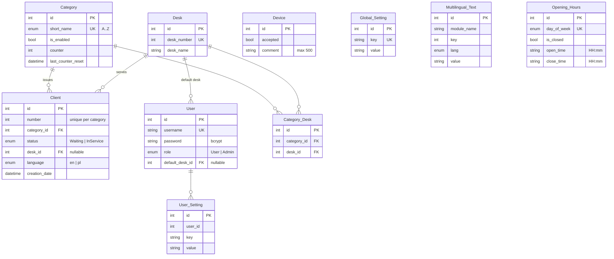

# Database

PostgreSQL, accessed through Prisma. Schema: `backend/prisma/schema.prisma`.

## Diagram



## Tables

### `Client`
One row per issued ticket. `(number, category_id)` is unique. `status` is `Waiting` or
`InService`; a client being served holds a `desk_id`. `language` records which language the client
picked at the kiosk, so the announcement is spoken in that language. Rows are deleted when service
finishes, when an admin flushes a category, or by the automatic reset
([architecture](architecture.md#automatic-ticket-number-reset)).

### `Category`
`short_name` is the ticket letter and is unique (`A`–`Z`, so at most 26 categories).
`is_enabled = false` hides it from the kiosk and rejects new tickets with a 400.
`counter` is the last issued number; `last_counter_reset` drives the reset logic.
Category **names** are not here — they live in `Multilingual_Text`, keyed by the category id.

### `Desk`
A service position. `desk_number` is unique and is what the TV and the voice announcement show.
Deleting a desk also deletes the clients assigned to it.

### `Category_Desk`
Many‑to‑many between categories and desks: which desks may serve which categories.

### `User`
Staff accounts. `password` is a bcrypt hash. `role` is `User` (desk panel) or `Admin`.
`default_desk_id` preselects a desk in the desk panel.

### `Device`
A kiosk or TV. Registering one returns a non‑expiring JWT; the row only stores
`accepted` (a kill switch) and an optional `comment` to identify it ("Entrance kiosk").
Setting `accepted = false` makes every request from that device fail with 403.

### `Global_Setting` / `User_Setting`
Key/value strings. The set of valid keys is defined in code
(`backend/src/global-settings/global-settings.list.ts`,
`backend/src/user-settings/user-settings.list.ts`), together with type and default. Rows exist only
for values that differ from the default, so "reset to defaults" is just a `DELETE`.

### `Multilingual_Text`
Every translatable string that is editable at runtime, keyed by `module_name + key + lang`:

| `module_name` | `key` | Used for |
|---|---|---|
| `categories` | category id | Category display name |
| `multilingual_settings` | `1` | `printing_ticket_template` |
| `multilingual_settings` | `2`–`8` | `monday_label` … `sunday_label` |

### `Opening_Hours`
One row per weekday. `is_closed` wins over the times; `open_time`/`close_time` are `HH:mm` strings.

## Enums

| Enum | Values |
|---|---|
| `Status` | `Waiting`, `InService` |
| `UserRole` | `User`, `Admin` (device access is JWT‑based, not a role row) |
| `LangCode` | `en`, `pl` |
| `DayOfWeek` | `MONDAY` … `SUNDAY` |
| `Category_Short_Name` | `A` … `Z` |

## Migrations

```bash
cd backend
yarn prisma migrate dev          # development: create + apply
npx prisma migrate deploy        # production: apply only
yarn prisma studio               # browse the data
yarn prisma generate             # regenerate the client after a schema change
```

The Docker entrypoint runs `prisma migrate deploy` on every container start, after resolving
`databaseUrl` from the external config file.

> [!NOTE]
> Adding a language means extending the `LangCode` enum, which is a migration. See
> [multilingual](i18n.md#adding-a-new-language).
