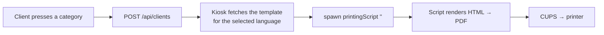

# Ticket printing

Printing is done by an **external script** that the kiosk spawns — Queue Master itself never talks
to a printer. That keeps printer drivers, paper sizes and exotic hardware out of the app: whatever
can print on your OS, can print a ticket.



## 1. Set up the printer

The example script uses **CUPS** (Linux/macOS).

```bash
sudo apt install cups python3-pip
sudo usermod -aG lpadmin $USER        # allow managing printers
```

Add the printer through the CUPS web UI at `http://localhost:631`, or with `lpadmin`. Then:

| Command | Purpose |
|---|---|
| `lpstat -a` | List installed printers — the name you need is the first column |
| `lpinfo -v` | List detected devices (USB, network) |
| `lpoptions -d <printer> -l` | List the options that printer supports |
| `lp -d <printer> file.pdf` | Test print |

Thermal ticket printers usually need the correct **media size** set as a default in CUPS, otherwise
every ticket comes out on a virtual A4 page.

## 2. Install the script

`scripts/printer-script/cups-printer-script.py`

```bash
pip install -r scripts/printer-script/cups-requirements.txt   # pymupdf, pycups
cp scripts/printer-script/cups-printer-script.py /opt/queue-master/
chmod +x /opt/queue-master/cups-printer-script.py
```

Edit the constants at the top:

| Constant | Meaning |
|---|---|
| `printerName` | CUPS printer name from `lpstat -a` |
| `printerOptions` | Dict of CUPS options, e.g. `{'media': 'A4'}` |
| `customWidth`, `customHeight` | Page size in **mm** — thermal tickets are often 58 × 70 |
| `pdfMargins` | `(left, top, right, bottom)` in points; negative values crop |
| `disablePrint` | `True` ⇒ only generate the PDF and print its path to stdout. Use this while tuning the template |

Point the kiosk at it:

```json
{ "printingScript": "/opt/queue-master/cups-printer-script.py" }
```

An empty `printingScript` disables printing entirely — useful for a ticketless kiosk that only
shows the number on screen.

## 3. The call contract

The kiosk spawns the script with **one argument**: a JSON object.

```bash
cups-printer-script.py '{"categoryShortName":"A","number":12,"queueLength":3,"template":"<html…>"}'
```

| Field | Type | Meaning |
|---|---|---|
| `categoryShortName` | string | Ticket letter, `A`–`Z` |
| `number` | number | Ticket number, 1–999 |
| `queueLength` | number | How many clients are already waiting in this category |
| `template` | string | The HTML template for the client's language, fetched from the server |

Write your own script in any language — it only has to accept that argument. stdout and stderr are
captured by the kiosk's main process (stdout only in development, stderr always), so `print()` is
your debugging channel.

## 4. The template

Edited in **Admin → Settings → Other → Printing template**, with a live preview.

> [!IMPORTANT]
> **The template is per language.** There is one template for each configured language, and the one
> used is the language **the client selected at the kiosk**. Filling in only English means clients
> who pick Polish get the placeholder text `Specify ticket template in settings for language pl`.
> Always fill in every language.

### Placeholders

Replaced by the script before rendering (`&` prefix, no closing token):

| Placeholder | Replaced with | Example |
|---|---|---|
| `&categoryShortName` | Category letter | `A` |
| `&number` | Ticket number | `12` |
| `&queueLength` | Clients waiting in this category | `3` |
| `&date` | Current date, `YYYY-MM-DD` | `2026-09-14` |
| `&time` | Current time, `HH:MM:SS` | `14:32:07` |

`&date` and `&time` are produced by the **script on the device**, so they follow the device clock.
A placeholder that does not exist is left in the output verbatim — a good way to spot typos.

### Example

```html
<div style="text-align: center; font-family: sans-serif;">
  <p style="font-size: 12pt; margin: 0;">City Office</p>
  <hr />
  <p style="font-size: 14pt; margin: 4px 0;">Your number</p>
  <p style="font-size: 48pt; font-weight: bold; margin: 8px 0;">
    &categoryShortName&number
  </p>
  <p style="font-size: 12pt; margin: 0;">Waiting before you: &queueLength</p>
  <hr />
  <p style="font-size: 10pt; margin: 0;">&date &time</p>
</div>
```

### What HTML is supported

The example script renders with **PyMuPDF's `Story`** engine, which supports a *subset* of HTML and
CSS — block and inline elements, text alignment, font size/weight/family, colours, simple tables,
images. It is not a browser: flexbox, grid, floats, web fonts and JavaScript do not work.

Practical rules:

- Use inline `style` attributes; a `<style>` block works but keep it simple.
- Size fonts in `pt` — the page is a few centimetres wide.
- Centre with `text-align: center` on a wrapping `<div>`.
- `<hr>`, `<br>`, `<b>`, `<i>`, `<u>`, `<p>`, `<div>`, `<span>`, `<table>` all behave.
- Test with `disablePrint = True` and open the generated PDF before wasting paper.

If you need full CSS, replace the script with one that uses a headless browser
(`chromium --headless --print-to-pdf`) — the contract stays the same.

## Troubleshooting

| Symptom | Cause |
|---|---|
| Nothing happens, log says `No printing script configured` | `printingScript` empty in `config.json` |
| `Script printingScript ended with 1` | The script crashed — run it by hand with the same JSON argument to see the traceback |
| `Script printingScript ended with 127` / ENOENT | Wrong path, missing shebang, or not executable (`chmod +x`) |
| PDF generated but nothing prints | Wrong `printerName`, or the CUPS queue is paused (`lpstat -p`) |
| Ticket prints on a huge page | `customWidth`/`customHeight` or the CUPS default media size |
| Template shows `&number` literally | The script did not substitute — you are using a script that does not implement the placeholders |
| Polish clients get English tickets | Template not filled in for that language |

The overlay shown on the kiosk while printing lasts `printingDialogueShowTime` ms and is purely
cosmetic — it is not tied to the script finishing. Set it roughly to how long your printer takes.
